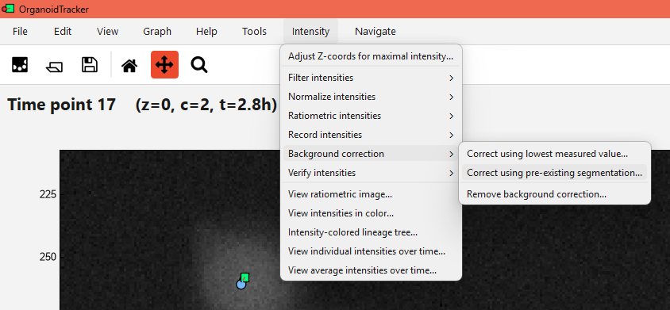

# Background correction

CellPhenTracker has two basic background correction methods built-in. They share one limitation: only one background value can be set per experiment per recorded intensity.

## Background estimation using lowest value

This method looks at the lowest recorded intensity for a cell, and assumes this to be the background value. Then, from this darkest intensity it calculates the background per pixel, and subtracts this from all intensities. This way, the lowest intensity becomes 0. This method works well if you were recording some reporter, and the lowest measured value corresponds to that reporter signal being off.

To use the method, use `Intensity` -> `Background correction` -> `Correct using lowest measured value...`

## Background estimation using pre-existing segmentation

If you have segmentations loaded, you can use these to define the background. Any region with no segmented object (a label of 0) is then assumed to be the background. The average value (across all time points and Z planes) is then used as the background.

Make sure your segmentations are loaded into the program. If not, use `Edit` -> `Append image channel...` to load them.

To use the method, use `Intensity` -> `Background correction` -> `Correct using pre-existing segmentation...`. Then, use the `Parameters` menu to set which channel is used for the measurements, which channel holds the segmentations, and which intensity should be corrected. Once set, use `Edit` -> `Record background` to record the background.

## Notes
* Background corrections don't actually modify the intensities, they just store some metadata value in `experiment.global_data`. Thus, you can later on change the correction method, or remove it altogether.
* More complex background corrections aren't supported in CellPhenTracker, but you can of course measure a separate set of intensities (for example in a ring around the cells) and do the corrections yourself in Excel or a similar program.
* If you change the background correction, any [normalization](normalizing_intensities.md) is removed, and you will have to redo the normalization. This is because the background correction changes the intensity values, and thus the normalization factor needs to be recalculated.
