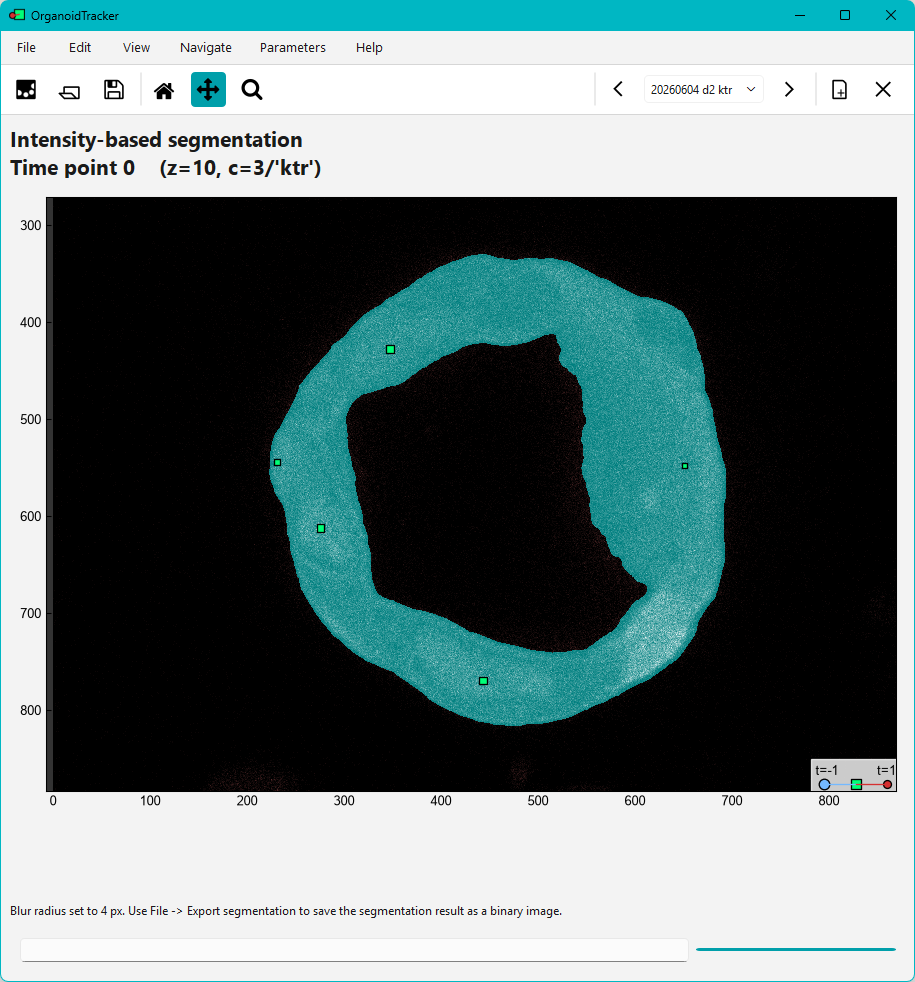

# Segmentation
The first step in measuring intensities, is deciding which pixel belong to which cell. In other words: you need to segment your cells. You can use some simple pseudo-segmentation methods, or an actual image-based segmentation method. With the improvements in Cellpose-SAM, the latter is now often the best option.

## Simple methods without segmentation
In the simplest case, you already have cell tracking data (or at least cell positions) available, and you simply to measure intensities in a circle or sphere around the cell position. This method is very fast, and is available in the `Intensity` -> `Record intensities` menu. You can set the radius of the circle/sphere, and the intensity will be measured as the sum or average intensity of all pixels within that circle/sphere.

A little more advanced method is to assign each pixel to the closest cell position, up to a certain distance. This is called a vertex model, and is also implemented in CellPhenTracker. Both methods are available in the `Intensity` -> `Record intensities` menu, and are easy to use (although the vertex model is slower to compute).

[⮩ **Continue to recording**](recording_intensities.md)

## Image-based segmentation
A more sophisticated approach is to use an actual image-based segmentation method. You can use any external program for this, and load the segmentation into OrganoidTracker (`Edit` -> `Append image channel...`).

CellPhenTracker also has a built-in method to segment your images, based on Cellpose-SAM. Your images will by default be downscaled to 1 micron per pixel, which makes the segmentation a lot faster and often also more robust, depending on your images. The resulting segmentations will then be upscaled using a Gaussian blur. This method is available as `Tools` -> `Segmentation` -> `Segment with scaled Cellpose-SAM model`. See below for more details.

### Cellpose-SAM segmentation method
From the `Tools` -> `Segmentation` menu, you can segment your images using a built-in method based on Cellpose-SAM. It is reasonably general and not too slow, but it does require a GPU. Make sure you are in the channel that you want to segment (like the nuclei), and then use the menu option. It will generate some scripts.

Besides the location of the input/output files, there a few parameters that you can adjust in the generated `organoid_tracker.ini` file. These are:

* `image_channel` - the image channel you want to segment. This is automatically set to the channel you had open when generating the scripts, but you can change it here.
* `target_resolution_zyx_um` - resolution your images will be rescaled to for segmentation.
* `min_percentile` and `max_percentile` - intensity scaling of your images for segmentation. Done per time point.
* `mask_refinement_cutoff` - after the initial segmentation, the masks are blown up in size to reach the original resolution. The masks are smoothed during this process. If your masks are too small, decrease this cutoff. If your masks are too big, increase this cutoff.
* `mask_smoothing_factor` - when blowing up the masks, they are smoothed. This parameter controls how much smoothing is applied. If you see artifacts of the lower resolution segmentation in your final masks, increase this factor. If your masks are too round and miss some protrusions, decrease this factor.

After running the script, a `.autlist` file will be generated in its output folder, which you can load back in OrganoidTracker to load all images with the segmentation. You can then proceed to record intensities using the segmentation, as described in the [recording intensities](recording_intensities.md) section.

### Intensity threshold-based segmentation
It's also possible to perform a classical intensity threshold-based segmentation. An advantage over CellPose-SAM is that it can segment objects of any shape, while CellPose-SAM is trained on roundish objects. The disadvantage is that it is less robust, and can easily undersegment objects. (Only objects that are fully separated from each other will be segmented correctly.) You can use the `Tools` -> `Segmentation` -> `Segment with intensity thresholding` menu option to perform this segmentation. You will end up in a new screen:

You can adjust the parameters using the Parameters menu on the top. The most important parameter is the intensity threshold. You can also smooth the image before segmentation, and apply dilation or erosion to the masks after segmentation. The segmentation is updated live, and is always performed on the currently visible channel.

If you're happy with the segmentation, you can save it using the `Edit` -> `Save segmentation` menu option. In the folder, a `.autlist` file will be generated, which you can load back in OrganoidTracker to load all images with the segmentation. You can then proceed to record intensities using the segmentation, as described in the [recording intensities](recording_intensities.md) section.
